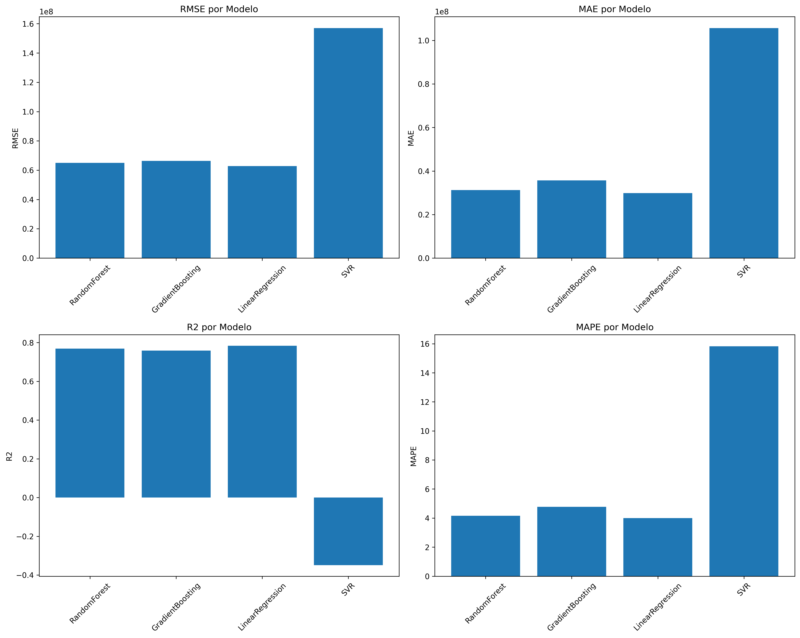

# UECE-RNP-2024-REF


 Este repositório implementa um pipeline de Machine Learning para previsão de séries temporais, utilizando dados da RNP (Rede Nacional de Pesquisa) do Brasil. Os modelos utilizados 
 são regressão linear, árvore de decisão, floresta aleatória, XGBoost e LSTM (Long Short-Term Memory). O pipeline inclui etapas de pré-processamento, treinamento e avaliação dos modelos, com o objetivo de fornecer previsões precisas e confiáveis.

 ## Funcionalidades
 [X] Pré-processamento de dados: definição de intervalos de tempo (6h-6h), imputação de valores ausentes e normalização dos dados.

 [X] Treinamento de modelos: regressão linear, floresta aleatória, gradiente Boosting e SVR (Support Vector Regression) para previsão de séries temporais.

[X] Avaliação dos modelos: avaliação do desempenho dos modelos utilizando métricas como erro absoluto médio (MAE), raiz do erro quadrático médio (RMSE), erro percentual absoluto médio (MAPE) e coeficiente de determinação (R²).

 [X] Visualização dos resultados: geração de gráficos para visualização das previsões e comparação entre os modelos.

 [] Treinamento dos modelos ARIMA e SARIMA - modelos de séries temporais clássicos.

 [] Treinamento do modelo LSTM - modelo de rede neural recorrente para séries temporais.

## Instalação das Dependências
Para instalar as dependências do projeto, execute o seguinte comando:

```bash 
pip install -r requirements.txt
```

## Execução
Para executar o pipeline de previsão de séries temporais, você pode clonar o repositório e executar o script principal para iniciar o pipeline de previsão de séries temporais:

```bash
# Clone o repositório
git clone https://github.com/LarcesUece/UECE-RNP-2024-REF.git

# Acesse o diretório do projeto
cd UECE-RNP-2024-REF

# Execute o script para treinamento e avaliação dos modelos
python src\models\time_series_prediction_model.py
```

## Análise dos Resultados
Após a execução do pipeline, os resultados das previsões podem ser analisados e comparados o desempenho entres os diferentes modelos de Machine Learning utilizados. Os resultados serão salvos em arquivos CSV na pasta `models/`. Como a imagem dos gráficos abaixo:



As métricas utilizadas para avaliar o desempenho dos modelos incluem:
- Erro Absoluto Médio (MAE): indica a média dos erros absolutos entre as previsões e os valores reais.
- Raiz do Erro Quadrático Médio (RMSE): indica a raiz quadrada da média dos erros quadráticos entre as previsões e os valores reais.
- Erro Percentual Absoluto Médio (MAPE): indica a média dos erros percentuais absolutos entre as previsões e os valores reais.
- Coeficiente de Determinação (R²): indica a proporção da variância dos dados que é explicada pelo modelo.

A análise dos modelos de regressão com base nas métricas RMSE, MAE, R² e MAPE indica que o modelo LinearRegression apresentou o melhor desempenho geral com os dados de vazão de 2024 e 2025. Ele obteve o menor erro quadrático médio, o menor erro absoluto médio, o maior coeficiente de determinação e o menor erro percentual médio, demonstrando maior precisão e capacidade de explicação dos dados.